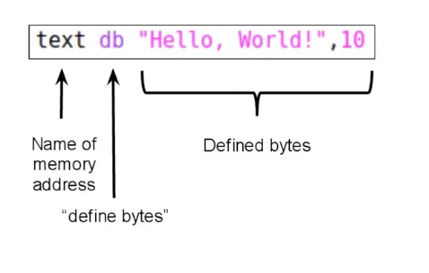
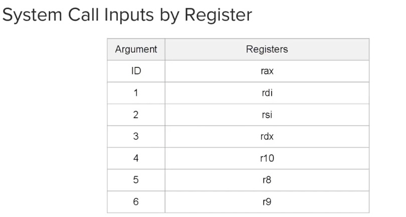
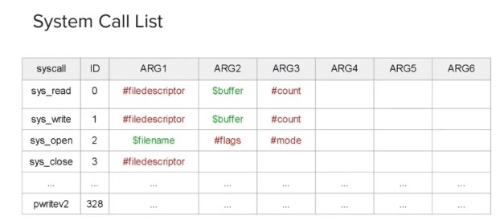

# 执行

`hello.s`是一个适用Linux的Hello World汇编程序（MacOS文件夹中的`hello.s`是适用macos的版本）, 我们可以首先使用 `nasm -f elf64 hello.s -o hello.o`生成一个目标文件(object file), 目标文件本身是无法执行的，需要执行链接: `ld hello.o -o hello`来获取一个可执行文件。 

> 对于macos可以使用如下命令进行操作: `nasm -f macho64 hello.s -o hello.o`, `ld`, 既可以得到可以运行的Hello World程序

# 基础语法

1. sections

汇编程序通常由三个程序块组成, 分别是 `.data`, `.bss`和`.text`。其中 `.data`表示在编译之前定义的数据，`.bss`表示为后续使用分配的数据，比如输入缓存等，`.text`存放代码。

2. labels 标号

`labels`通常标记一段代码，如`hello.s`中的 `_start`, 在编译过程中汇编器会计算代码段实际的地址，在运行中进行替换。

3. global声明

`global`的作用是：保证链接器linker可以获取到label对应的地址，每个被`global`标识的label在目标文件中都会包含一个链接。在`hello.s`中 `_start`必须声明为`global`, 因为这是入口函数。

4. db

`db`表示`define bytes`, 表示定义一些字节数据。由于换行符无法打出，在`hello.s`输入的是其ASCII码值10。 

`text db "Hello,World!",10`中 `text`是变量名称，代表这段数据加载的地址（address in memory that this data is located in）, 实际地址由编译器决定。

5. syscall

`syscall`表示一个系统调用，不同的操作系统有不同kernel, 但每一个系统调用都有一个ID以及一系列入参，这些入参都是基于寄存器的。

[Linux系统调用](https://chromium.googlesource.com/chromiumos/docs/+/master/constants/syscalls.md)

> Linux中常用的文件描述符（file descriptor）: 0对应标准输入，1对应标准输出，2对应标准错误输出

MacOS系统调用:

在`hello.s`的代码中，我们执行了两个系统调用，分别是

# 寄存器

寄存器是CPU内部用来存放数据的小型存储区域，用于暂时存放参与运算的数据和运算结果，本质上是具有存储功能的锁存器或者触发器组合构成的。从功能上划分，寄存器通常分为通用寄存器、专用寄存器和控制寄存器。

寄存器拥有非常高的读写数据，所以在寄存器之间的数据传送非常快。

# 代码解析

`hello.s`首先我们定义了 `text`这个变量存放字符串 `Hello,World!\n`, 然后在 `_start`函数中我们首先将 `rax`寄存器（如果是32位的汇编程序）